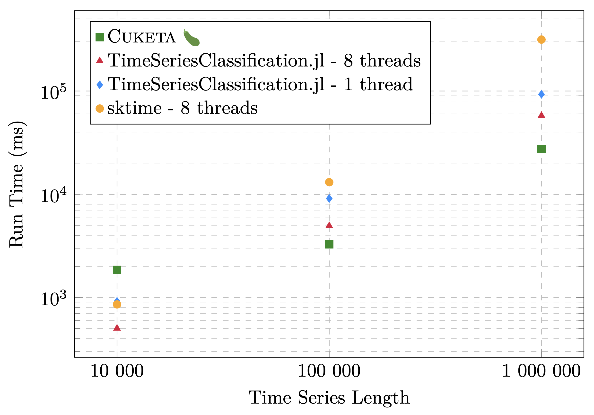

# CUKETA 

CUKETA, pronounced _/sʊketa/_, is not only a Czech word for zucchini, but also _**CU**DA Accelerated Minimally Random Convolutional **Ke**rnel **T**r**a**nsform_.

CUKETA is a CUDA implementation of the MiniRocket algorithm [[1]](#Citations), or rather it's Julia re-implementation from the [TimeSeriesClassification.jl](https://github.com/antoninkriz/TimeSeriesClassification.jl) [[2]](#Citations) package.

> This project came to life as a semestral project from the NI-GPU | GPU Architectures and Programming class at FIT CTU in Prague.

For more detail see the [report paper](report/main.pdf) in `report/main.pdf`, which quickly introduces the MiniRocket algorithm and goes into more details regarding the CUDA implementation and benchmarks.

## Benchmark

The lower the shape, the better. :)



## Usage

See usage in `main.cu` in the `main()` function. Mostly it boils down to:

```cpp
auto [dilations, num_features_per_dilation, biases] = fit(X, num_examples, input_length);
auto transform_res = transform(X, num_examples, input_length, dilations, num_features_per_dilation, biases);
```

### Compile code

To compile the code and benchmarks, you should have GCC, CMake, Julia, and CUDA SDK installed on your machine.  
The versions should not really matter as long as it's "recent enough", i.e. GCC 12+, CMake 3.28+, Julia 1.9+ and CUDA 12+.  
For Python you'll also need packages `sktime`, `numpy` and `numba`, for Julia you'll need `TimeSeriesClassification.jl`.

Steps to compile and run the CUDA code:
1. Have fun!
2. Use CMake to compile the code
3. Run the compiled binary
4. Have fun!

### Run benchmarks

See code in each file for more details.

**Python**:
```bash
python mrmini.py
```

**Julia**:
```bash
julia mrmini.jl
```

**CUDA**:
See `main.cu` for more details. Don't forget to set correct input sizes.

```bash
# Compiled binaries will be in this folder
mkdir compiled
# Compile the code for each block size specified in the `batch_compile.py` file
python batch_compile.py
# Run the compiled binaries
python batch_run_all.sh
```

## Citations

[1] Dempster, A., Schmidt, D. F., and Webb, G. I., “MINIROCKET: A Very Fast (Almost) Deterministic Transform for Time Series Classification”, <i>arXiv e-prints</i>, 2020. doi:10.48550/arXiv.2012.08791.

[2] https://github.com/antoninkriz/TimeSeriesClassification.jl
